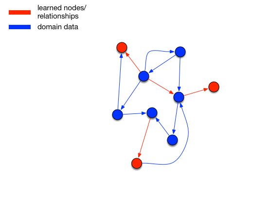

# MWG machine learning library

MWG provides a built-in machine learning library that allows to seamlessly mix learning into a graph, i.e., it allows to create graphs which are composed of learned nodes and 'normal' graph nodes, just like indicated in the figure below. 

> Why mixing learning and domain data?

To make smart decisions, intelligent systems have to continuously refine behaviour that is known at design time with what can be learned only from live data to solve known unknowns.
Machine learning algorithms are designed to resolve unknown behaviours by extracting commonalities over massive datasets.
MWG allows to decompose machine learning into reusable, chainable, and independently computable learning units. These can be modelled together with and at the same level than domain data.

