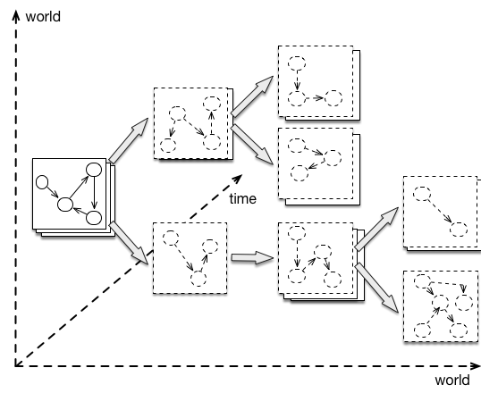

# Many-world graphs
Prescriptive analytics call for efficient solutions to explore alternative futures, which inevitably diverge when exploring the effects of *what-if* decisions. This is shown in the following figure:




The concept of many-world graphs allows to efficiently fork and update thousands of parallel worlds, even for temporal graphs. 

First, we create again a graph, just like for a simple graph

```java
Graph g = new GraphBuilder().build();
g.connect(isConnected -> {
	    //your next code goes here...
});
```

Then, we specify a time point and  a world and create nodes, attributes, and relations. 

```java
long timepoint_0 = 0;
long world_0 = 0; //identifies an alternative

Node sensor0 = g.newNode(world_0, timepoint_0); //the first param is the world
sensor0.set("id", "4494F");
sensor0.set("name", "sensor0");
sensor0.set("value", 26.2); //set the value of the sensor

Node room0 = g.newNode(world_0, timepoint_0); //the first param is the word
room0.set("name", "room0");
room0.add("sensors", sensor0);
```

In this example, node *sensor0* and *room0* is created in *world_0*. Other worlds are not impacted by this change. This allows to efficiently create alternative worlds. The jump function can be used to select an arbitrary node within a world. 


