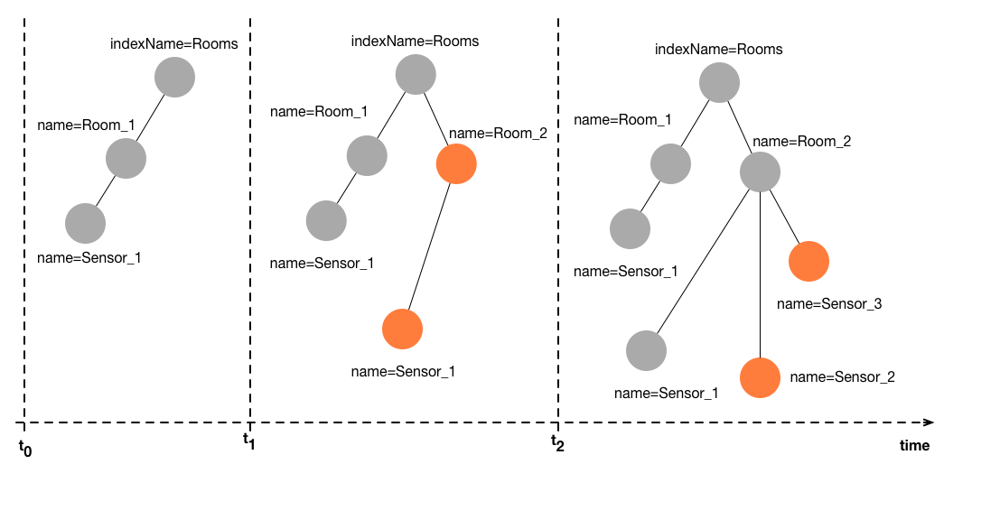

# Temporal graphs

Many domains, from social networks to cyber-physical systems to enterprise applications, need to deal with dynamic, i.e., time-evolving data. Think of a time-evolving graph like the following figure:



The orange nodes in the graph represent the changes compared to the version before. Over time, both attributes of nodes, i.e., values, as well as the structure of the graph itself can arbitiraly change. Usually, considering only the latest state of a graph is not enough, instead, many applications require to analyse and correlate past data. That is where temporal graphs are required. 

First, we create again a graph, just like for the non-temporal example

```java
Graph g = new GraphBuilder().build();
g.connect(isConnected -> {
	    //your next code goes here...
});
```

Then, we specify a time point and create nodes, attributes, and relations

```java
long timepoint_0 = 0;

Node sensor0 = g.newNode(0, timepoint_0); //the second param is the time
sensor0.set("id", "4494F");
sensor0.set("name", "sensor0");
sensor0.set("value", 26.2); //set the value of the sensor

Node room0 = g.newNode(0, timepoint_0); //the second param is the time
room0.set("name", "room0");
room0.add("sensors", sensor0);
```

Nodes can be freely 'moved in time'

```java
sensor0.jump(System.currentTimeMillis(), (Node sensor0now) -> {
	sensor0now.set("value", 27.5); //update the value to time: now
	System.out.println("T0:" + sensor0.toString());
	System.out.println("Now:" + sensor0now.toString());

	//now jump over the room
	room0.jump(System.currentTimeMillis(), room0now -> {
		System.out.println("RoomNow:");
		room0now.rel("sensors", sensorsNow -> {
			for(Node sensorNow : sensorsNow){
				System.out.println("\t"+sensorNow.toString());
			}
		 });
	});
});
```

The method *jump* can be used to resolve a node at an arbitrary time point. In the example above, the node *room0* is resolved at the current time. The last valid version of *room0*, relative to the time asked (current time) is *room0* at time point 0. This version is transparently resolved. The graph can be freely traversed from this node and it automatically the correct versions of the traversed nodes are resolved. 

