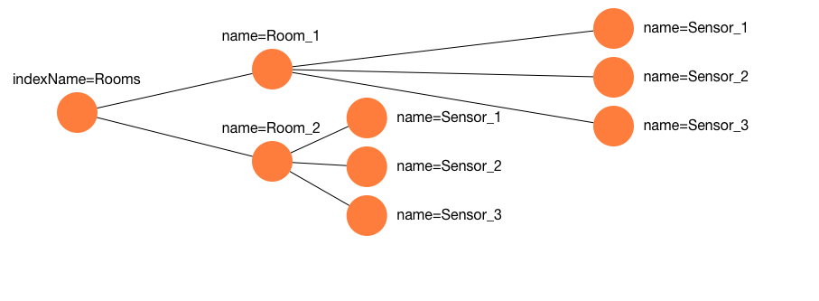

# MWG Task API

> Why a (task/traversal/promise) API ?

Manipulating the Many World Graph through an asynchronous API allows to write blazing-fast code without compromising on high-level abstractions. 
However, asynchronous code often leads to what is known as [CallBack Hell](http://callbackhell.com/), that damage both the readability of code and its reusability, due to nested callbacks. 
To overcome this, modern libraries and APIs provide Promises and/or Futures. 
The common goal of these approaches is to offer a way to chain reusable elements and to synchronize the program flow in order to avoid repeated and error-prone code. 
MWG comes with a powerful API to manipulate and traverse graphs, which hides low-level, asynchronous task primitives behind an expressive API. 

# Taxonomy of a Task

In a nutshell a task is describing a sequence of actions, which pipe their results from actions to actions.
So in the java API this describes a flow such as: action1 -> action2 ...

``` java
Tasks.newTask()
.then(action1(param))
.then(action2(param1, param2))
```

For core actions (present without plugin) the then wrapper is optional.

``` java
Tasks.newTask()
.coreAction1(param)
.then(action2(param1, param2))
```


# Running example

Let's consider the following simple graph as a running example:

> A graph composed by 2 rooms, themselves composed by 3 sensors associated through the relation: __sensors__ . All rooms should be indexed by their name, through the global index: __rooms__.

This graph can be built by the following task, build using the fluent Java DSL.

``` java
loop("1","2",
	newNode()
	.setProperty("name", Type.STRING, "room_{{i}}")
	.indexNode("rooms", "name")
	.asVar("parentRoom")
	.loop("1","3",
		newNode()
		.setProperty("sensor", Type.STRING, "sensor_{{i}}")
		.addTo("sensors", "parentRoom")
	)
).execute(g, null);
```

Without black magic, actions are just chained by `.` as any fluent DSL an initial action can be transparently built using a global static import.

```java
import static org.mwg.core.task.Actions.*;
```

The result graph can be represented as follow:


